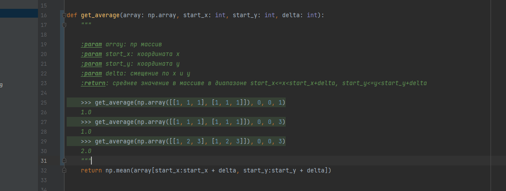

#Батуев Макар АТ-28

## Время работы:

### Время работы filter.py (26433 ms):

### Время работы old-filter.py.py (1170 ms):

### Время работы filter_with_filename.py (81 ms):

### Объяснение результатов:

Самое большое время исполнения у первого фильтра, так там мы вводим данные с консоли. old-filter.py выполняет свою
задачу гораздо медленнее filter_with_filename.py. В исправленном фильтре я избавился от ручных циклов, переделал их в
матричные преобразования, что позволило повысить скорость выполнения кода.

## Тесты и документация:

### Пример теста:

### Пример запуска правильного теста:

### Пример неправильного теста:

## Отладчик:

### Введенные данные:

### Свойства и тип изображения:

### Значения ширины блока и градации серого:

